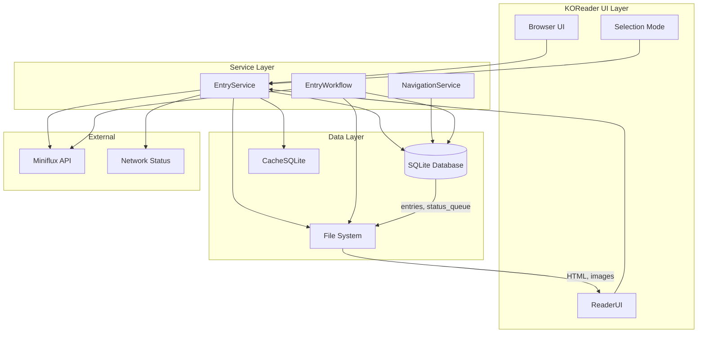
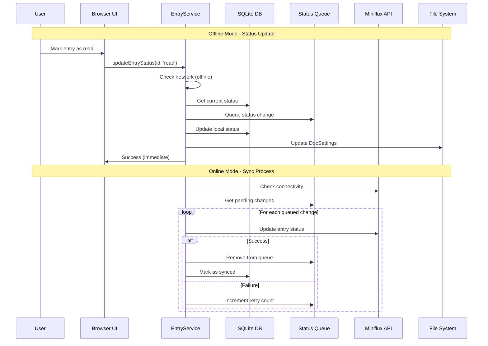
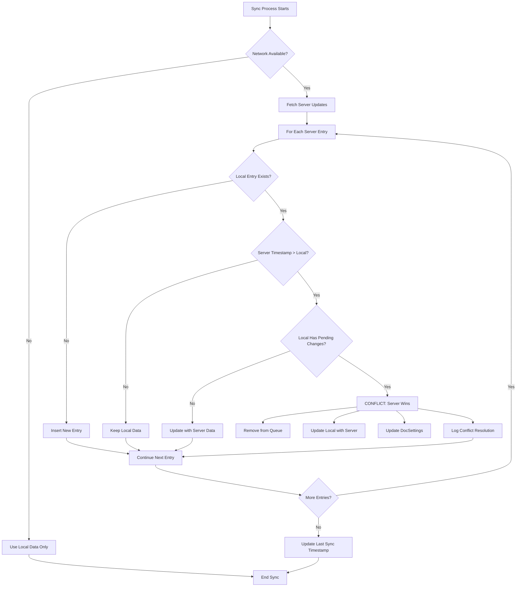
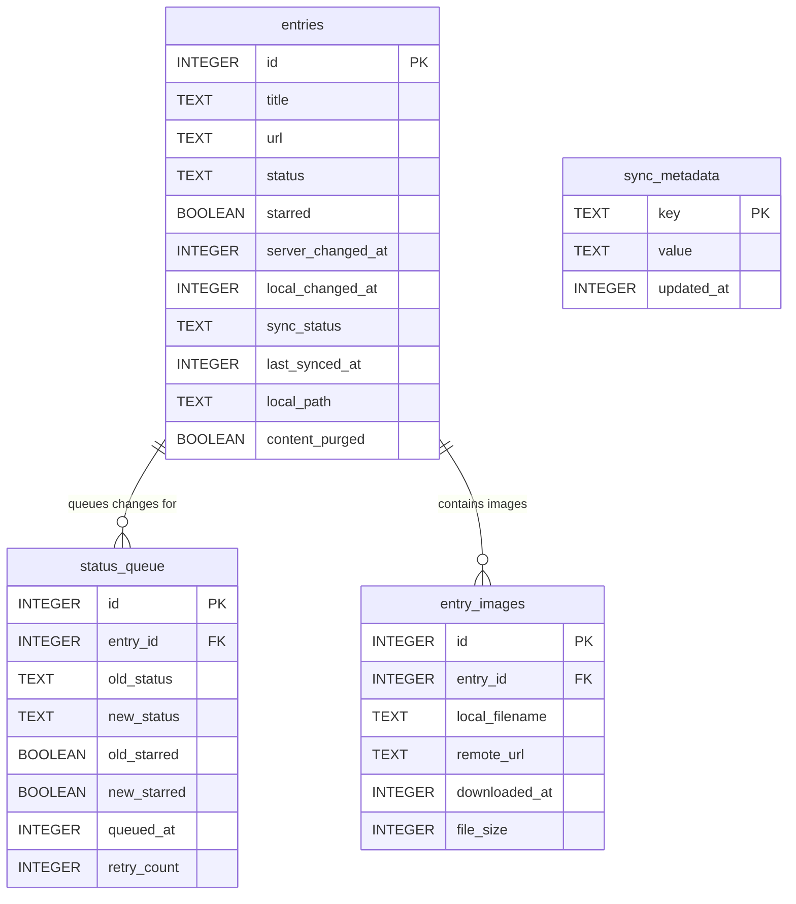
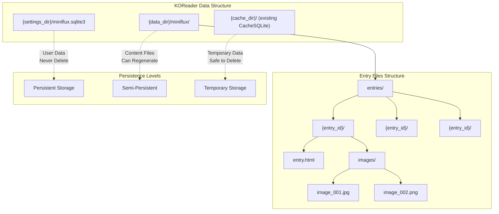

# Offline-First Architecture for Miniflux Plugin

## Overview

This document outlines the offline-first architecture improvements for the Miniflux KOReader plugin. The goal is to enable comprehensive offline reading capabilities while maintaining optimal performance on e-ink devices with limited storage and memory.

## Core Principles

### Offline-First Design
- **Local database as primary data source** for downloaded content
- **Graceful degradation** when server is unavailable
- **Selective synchronization** to manage storage constraints
- **User control** over local content lifecycle

### E-ink Device Optimization
- **Minimal memory footprint** for database operations
- **Efficient storage utilization** with automatic cleanup
- **Fast UI updates** without network dependency
- **Battery-conscious** background operations

## Architecture Components

### 1. Local SQLite Database

#### Schema Design
```sql
-- Core entries table with essential metadata
CREATE TABLE entries (
    id INTEGER PRIMARY KEY,
    title TEXT NOT NULL,
    url TEXT NOT NULL,
    author TEXT,
    content TEXT,  -- Nullable after HTML creation
    published_at INTEGER,
    created_at INTEGER,
    starred BOOLEAN DEFAULT 0,
    reading_time INTEGER,
    status TEXT DEFAULT 'unread',  -- unread, read, starred
    feed_id INTEGER,
    feed_title TEXT,
    feed_site_url TEXT,
    category_id INTEGER,
    category_title TEXT,
    local_path TEXT,  -- Path to HTML file if downloaded
    downloaded_at INTEGER,
    content_purged BOOLEAN DEFAULT 0  -- Track if content was purged to save space
);

-- Image mapping for offline image management
CREATE TABLE entry_images (
    id INTEGER PRIMARY KEY AUTOINCREMENT,
    entry_id INTEGER,
    local_filename TEXT,
    remote_url TEXT,
    downloaded_at INTEGER,
    file_size INTEGER,
    FOREIGN KEY (entry_id) REFERENCES entries(id) ON DELETE CASCADE
);

-- Sync metadata for server coordination
CREATE TABLE sync_metadata (
    key TEXT PRIMARY KEY,
    value TEXT,
    updated_at INTEGER
);
```

#### Database Location and Organization
- **Database Path**: `{DataStorage:getSettingsDir()}/miniflux.sqlite3` (persistent storage)
- **Entries Path**: `{DataStorage:getDataDir()}/miniflux/entries/` (persistent storage)
- **Size Target**: < 50MB for optimal e-ink performance
- **File Structure**:
  ```
  {settings_dir}/
  └── miniflux.sqlite3      # Main database (persistent)
  
  {data_dir}/miniflux/
  └── entries/
      ├── {entry_id}/
      │   ├── entry.html
      │   └── images/
      │       ├── image_001.jpg
      │       └── image_002.png
      └── {entry_id}/...
  ```

**Storage Philosophy:**
- **Database**: In settings directory (won't be deleted, contains user's reading data)
- **Entry Files**: In data directory (persistent but can be regenerated from server)
- **Cache**: Keep using existing CacheSQLite for temporary feed/category metadata

### 2. Content Lifecycle Management

#### Phase 1: Download and Store
1. **Fetch entry metadata** via Miniflux API
2. **Store complete data** in local database
3. **Download and process images** (store mapping in entry_images table)
4. **Generate HTML file** with embedded/linked images
5. **Purge content field** from database to save space
6. **Update local_path and content_purged** flags

#### Phase 2: Reading and Navigation
1. **Query local database** for entry lists and metadata
2. **Open HTML files** directly for reading
3. **Update reading status** locally with periodic sync
4. **Navigate using local data** for instant responses

#### Phase 3: Cleanup and Management
1. **User-initiated deletion** of selected entries
2. **Automatic cleanup** of old entries based on settings
3. **Selective image purging** while maintaining readability
4. **Content restoration** from server when needed

### 3. Entry Deletion System

#### Selection Mode Enhancement
- **Delete button visibility**: Show when ≥1 local entry selected
- **Mixed selection handling**: Process only local entries, ignore remote
- **Batch operations**: Delete multiple entries efficiently
- **State preservation**: Maintain selection after deletion for additional operations

#### Deletion Process
```lua
function deleteSelectedEntries(selected_entries)
    local local_entries = filterLocalEntries(selected_entries)
    
    for _, entry in ipairs(local_entries) do
        -- 1. Delete HTML file and images folder
        deleteEntryFiles(entry.local_path)
        
        -- 2. Remove from local database
        removeFromDatabase(entry.id)
        
        -- 3. Update UI state
        updateViewAfterDeletion(entry.id)
    end
    
    -- TODO: Implement content restoration capability
    -- Parse deleted HTML content and restore to database
    -- for potential re-download without full re-processing
end
```

#### File System Operations
- **Complete folder removal**: `miniflux/entries/{entry_id}/`
- **Cascading cleanup**: HTML, images, metadata, database record
- **Error handling**: Graceful failure for partial deletions
- **Undo consideration**: Future enhancement for deletion recovery

### 4. Image Management System

#### Mapping Table Design
```lua
-- Example image mapping structure
entry_images = {
    {
        entry_id = 12345,
        local_filename = "image_001.jpg",
        remote_url = "https://example.com/image.jpg",
        downloaded_at = 1647789600,
        file_size = 45231
    }
}
```

#### Image Lifecycle
1. **Download Phase**: Store URL-to-filename mapping
2. **Display Phase**: Use local files with fallback to broken image placeholder
3. **Purge Phase**: Delete image files but retain mapping for future re-download
4. **Restoration Phase**: Re-download using stored URLs and filenames

#### Storage Optimization
- **Selective purging**: Allow users to remove images while keeping articles
- **Size tracking**: Monitor storage usage per entry
- **Format optimization**: Convert images for e-ink display
- **Lazy loading**: Download images on-demand for large entries

### 5. API Integration Strategy

#### Miniflux API Compatibility
Based on [Miniflux API documentation](https://miniflux.app/docs/api.html):

##### Efficient Endpoints
- **GET /v1/entries**: Paginated entry fetching with filters
- **PUT /v1/entries**: Batch status updates for synchronization
- **GET /v1/feeds**: Lightweight feed metadata
- **GET /v1/categories**: Category information

##### Performance Considerations
- **Pagination**: Use `limit` and `offset` for large feeds
- **Filtering**: Apply `status` and `category_id` filters server-side
- **Batch updates**: Group status changes to minimize API calls
- **Rate limiting**: Respect server limits with exponential backoff

#### Synchronization Strategy
```lua
-- Example sync workflow
function syncWithServer()
    -- 1. Upload local status changes
    uploadLocalChanges()
    
    -- 2. Fetch server updates since last sync
    local server_updates = fetchServerUpdates(last_sync_timestamp)
    
    -- 3. Resolve conflicts (server wins for simplicity)
    resolveConflicts(server_updates)
    
    -- 4. Update local database
    updateLocalDatabase(server_updates)
    
    -- 5. Clean up deleted entries
    cleanupDeletedEntries()
end
```

## Detailed Synchronization Strategy with Conflict Resolution

### Database Schema for Conflict Resolution

The enhanced schema includes fields specifically designed for graceful conflict resolution where **server is always the source of truth**:

```sql
-- Enhanced entries table with conflict resolution
CREATE TABLE entries (
    -- ... existing fields ...
    server_changed_at INTEGER,  -- Server's last modification timestamp from API
    local_changed_at INTEGER,   -- Local modification timestamp
    sync_status TEXT DEFAULT 'synced',  -- synced, pending_upload, conflict
    last_synced_at INTEGER      -- When this entry was last synchronized
);

-- Status change queue for offline operations
CREATE TABLE status_queue (
    id INTEGER PRIMARY KEY AUTOINCREMENT,
    entry_id INTEGER NOT NULL,
    old_status TEXT NOT NULL,
    new_status TEXT NOT NULL,
    old_starred BOOLEAN NOT NULL,
    new_starred BOOLEAN NOT NULL,
    queued_at INTEGER NOT NULL,
    retry_count INTEGER DEFAULT 0,
    FOREIGN KEY (entry_id) REFERENCES entries(id) ON DELETE CASCADE
);
```

### KOReader-Optimized Database Implementation

```lua
local SQ3 = require("lua-ljsqlite3/init")
local DataStorage = require("datastorage")
local Device = require("device")
local logger = require("logger")

local MinifluxDB = {}

function MinifluxDB:init()
    self.db_path = DataStorage:getSettingsDir() .. "/miniflux.sqlite3"
    self:createDatabase()
end

function MinifluxDB:createDatabase()
    local db = SQ3.open(self.db_path)
    
    -- Use KOReader's WAL utility pattern
    if Device:canUseWAL() then
        db:exec("PRAGMA journal_mode=WAL;")
    else
        db:exec("PRAGMA journal_mode=TRUNCATE;")
    end
    
    -- Performance optimizations (KOReader pattern)
    db:exec("PRAGMA synchronous=NORMAL;")
    db:exec("PRAGMA cache_size=10000;")
    db:exec("PRAGMA temp_store=MEMORY;")
    
    -- Schema creation using double brackets (KOReader standard)
    db:exec([[
        CREATE TABLE IF NOT EXISTS entries (
            id INTEGER PRIMARY KEY,
            title TEXT NOT NULL,
            url TEXT NOT NULL,
            author TEXT,
            content TEXT,
            published_at INTEGER,
            created_at INTEGER,
            starred BOOLEAN DEFAULT 0,
            reading_time INTEGER,
            status TEXT DEFAULT 'unread',
            feed_id INTEGER,
            feed_title TEXT,
            feed_site_url TEXT,
            category_id INTEGER,
            category_title TEXT,
            local_path TEXT,
            downloaded_at INTEGER,
            content_purged BOOLEAN DEFAULT 0,
            server_changed_at INTEGER,
            local_changed_at INTEGER,
            sync_status TEXT DEFAULT 'synced',
            last_synced_at INTEGER
        );
    ]])
    
    db:exec([[
        CREATE TABLE IF NOT EXISTS status_queue (
            id INTEGER PRIMARY KEY AUTOINCREMENT,
            entry_id INTEGER NOT NULL,
            old_status TEXT NOT NULL,
            new_status TEXT NOT NULL,
            old_starred BOOLEAN NOT NULL,
            new_starred BOOLEAN NOT NULL,
            queued_at INTEGER NOT NULL,
            retry_count INTEGER DEFAULT 0,
            FOREIGN KEY (entry_id) REFERENCES entries(id) ON DELETE CASCADE
        );
    ]])
    
    -- Indexes for performance
    db:exec([[
        CREATE INDEX IF NOT EXISTS idx_entries_sync ON entries(sync_status, last_synced_at);
        CREATE INDEX IF NOT EXISTS idx_status_queue_retry ON status_queue(retry_count, queued_at);
    ]])
    
    -- Version management
    local db_version = tonumber(db:rowexec("PRAGMA user_version;") or 0)
    if db_version < 1 then
        db:exec("PRAGMA user_version=1;")
    end
    
    db:close()
end

-- Safe database operation with error handling (KOReader pattern)
function MinifluxDB:safeExec(sql, params)
    local db = SQ3.open(self.db_path)
    local ok, result = pcall(function()
        if params then
            local stmt = db:prepare(sql)
            stmt:bind(table.unpack(params))
            local ret = stmt:step()
            stmt:clearbind():reset()
            return ret
        else
            return db:exec(sql)
        end
    end)
    db:close()
    
    if not ok then
        logger.err("MinifluxDB: Database operation failed:", result)
        return nil
    end
    return result
end
```

### Phase-by-Phase Synchronization Implementation

#### Phase 1: Offline Status Changes (Queue Management)

```lua
-- Queue status change for offline processing
function MinifluxDB:queueStatusChange(entry_id, old_status, new_status, old_starred, new_starred)
    -- Check if there's already a queue item for this entry
    local db = SQ3.open(self.db_path)
    local existing = db:rowexec([[
        SELECT id, old_status, old_starred FROM status_queue 
        WHERE entry_id = ? ORDER BY queued_at DESC LIMIT 1
    ]], entry_id)
    
    if existing then
        -- Update existing queue item to chain changes
        db:exec([[
            UPDATE status_queue 
            SET new_status = ?, new_starred = ?, queued_at = ?
            WHERE id = ?
        ]], new_status, new_starred, os.time(), existing.id)
    else
        -- Create new queue item
        db:exec([[
            INSERT INTO status_queue 
            (entry_id, old_status, new_status, old_starred, new_starred, queued_at)
            VALUES (?, ?, ?, ?, ?, ?)
        ]], entry_id, old_status, new_status, old_starred, new_starred, os.time())
    end
    
    -- Update local entry immediately for UI responsiveness
    db:exec([[
        UPDATE entries 
        SET status = ?, starred = ?, local_changed_at = ?, sync_status = 'pending_upload'
        WHERE id = ?
    ]], new_status, new_starred, os.time(), entry_id)
    
    db:close()
end

-- Process offline status changes when online
function MinifluxDB:processStatusQueue()
    local db = SQ3.open(self.db_path)
    local queue_items = db:exec([[
        SELECT * FROM status_queue 
        WHERE retry_count < 3 
        ORDER BY queued_at ASC
    ]])
    
    for _, item in ipairs(queue_items) do
        local success = self:syncStatusToServer(item)
        if success then
            -- Remove from queue and mark as synced
            db:exec("DELETE FROM status_queue WHERE id = ?", item.id)
            db:exec([[
                UPDATE entries 
                SET sync_status = 'synced', last_synced_at = ?
                WHERE id = ?
            ]], os.time(), item.entry_id)
        else
            -- Increment retry count
            db:exec([[
                UPDATE status_queue 
                SET retry_count = retry_count + 1 
                WHERE id = ?
            ]], item.id)
        end
    end
    
    db:close()
end
```

#### Phase 2: Server Conflict Resolution (Server Wins)

```lua
-- Resolve conflicts when server has newer data
function MinifluxDB:resolveEntryConflict(server_entry)
    local db = SQ3.open(self.db_path)
    
    -- Get local entry state
    local local_entry = db:rowexec([[
        SELECT server_changed_at, local_changed_at, sync_status 
        FROM entries WHERE id = ?
    ]], server_entry.id)
    
    if not local_entry then
        -- New entry from server, just insert
        self:insertServerEntry(server_entry)
        db:close()
        return
    end
    
    -- Check for conflict
    local server_time = server_entry.changed_at or server_entry.published_at
    local local_time = local_entry.local_changed_at or 0
    
    if server_time > (local_entry.server_changed_at or 0) then
        -- Server has newer data - server wins
        if local_entry.sync_status == 'pending_upload' then
            -- Remove conflicting queue item
            db:exec("DELETE FROM status_queue WHERE entry_id = ?", server_entry.id)
            logger.info("MinifluxDB: Resolved conflict - server wins for entry", server_entry.id)
        end
        
        -- Update with server data
        db:exec([[
            UPDATE entries 
            SET status = ?, starred = ?, title = ?, author = ?,
                server_changed_at = ?, sync_status = 'synced',
                last_synced_at = ?
            WHERE id = ?
        ]], server_entry.status, server_entry.starred, server_entry.title,
            server_entry.author, server_time, os.time(), server_entry.id)
        
        -- Update metadata (DocSettings) if needed
        self:updateLocalMetadata(server_entry)
    end
    
    db:close()
end

-- Update local metadata and DocSettings when server wins conflict
function MinifluxDB:updateLocalMetadata(server_entry)
    local DocSettings = require("docsettings")
    
    -- Update local HTML metadata if it exists
    if server_entry.local_path and lfs.attributes(server_entry.local_path) then
        local doc_settings = DocSettings:open(server_entry.local_path)
        doc_settings:saveSetting("miniflux_status", server_entry.status)
        doc_settings:saveSetting("miniflux_starred", server_entry.starred)
        doc_settings:flush()
    end
end
```

#### Phase 3: Incremental Sync with Timestamps

```lua
-- Perform incremental sync using server timestamps
function MinifluxDB:performIncrementalSync()
    -- Get last sync timestamp
    local db = SQ3.open(self.db_path)
    local last_sync = tonumber(db:rowexec([[
        SELECT value FROM sync_metadata WHERE key = 'last_sync_timestamp'
    ]]) or 0)
    db:close()
    
    -- Fetch entries modified since last sync
    local api_params = {
        changed_after = last_sync,
        limit = 100,  -- Paginate to handle large updates
        order = "changed_at",
        direction = "asc"
    }
    
    local modified_entries = self.api:getEntries(api_params)
    
    -- Process each modified entry
    for _, entry in ipairs(modified_entries) do
        self:resolveEntryConflict(entry)
    end
    
    -- Update last sync timestamp
    db = SQ3.open(self.db_path)
    db:exec([[
        INSERT OR REPLACE INTO sync_metadata (key, value, updated_at)
        VALUES ('last_sync_timestamp', ?, ?)
    ]], os.time(), os.time())
    db:close()
end
```

### Offline Mode Status Update Strategy

When marking entries as read/unread in offline mode:

```lua
-- Handle status update in offline mode
function EntryService:updateEntryStatus(entry_id, new_status, new_starred)
    local network_available = self:isNetworkAvailable()
    
    if network_available then
        -- Try immediate API update
        local success = self:updateStatusOnServer(entry_id, new_status, new_starred)
        if success then
            self:updateLocalStatus(entry_id, new_status, new_starred, 'synced')
            return true
        end
    end
    
    -- Queue for offline processing
    local db = MinifluxDB:getInstance()
    local old_status, old_starred = db:getEntryStatus(entry_id)
    
    db:queueStatusChange(entry_id, old_status, new_status, old_starred, new_starred)
    
    -- Update DocSettings immediately for local reading
    self:updateDocSettings(entry_id, new_status, new_starred)
    
    return true
end

-- Update DocSettings for immediate local effect
function EntryService:updateDocSettings(entry_id, status, starred)
    local DocSettings = require("docsettings")
    local entry_path = self:getEntryHTMLPath(entry_id)
    
    if entry_path and lfs.attributes(entry_path) then
        local doc_settings = DocSettings:open(entry_path)
        doc_settings:saveSetting("miniflux_status", status)
        doc_settings:saveSetting("miniflux_starred", starred)
        doc_settings:flush()
    end
end
```

## Architecture Diagrams

### System Architecture Overview



### Offline-First Data Flow



### Conflict Resolution Flow



### Database Schema Relationships



### File System Organization



## Implementation Phases

### Phase 1: Core Database Infrastructure
- [ ] Create SQLite database schema
- [ ] Implement basic CRUD operations
- [ ] Add database cleanup utilities

### Phase 2: Entry Deletion System (Most Urgent)
- [ ] Enhance selection mode with delete button
- [ ] Implement deletion workflow
- [ ] Add UI feedback and error handling
- [ ] Test with mixed local/remote selections

### Phase 3: Image Management
- [ ] Create image mapping table
- [ ] Implement image purging functionality
- [ ] Add broken image placeholders
- [ ] Build image re-download system

### Phase 4: Critical Bug Fixes (Immediate Priority)
- [ ] **Fix local entries ordering**: Make `EntryEntity.getLocalEntries()` respect user's order/direction settings
- [ ] **Fix offline navigation**: Update `Navigation.findAdjacentEntryId()` to use proper ordering instead of ID-based logic
- [ ] **Fix offline UX in main view**: Prevent network errors when cached data is available but stale

### Phase 5: Advanced Offline Features
- [ ] Content restoration from deleted entries
- [ ] Selective sync preferences
- [ ] Offline search capabilities
- [ ] Background sync scheduling

## Additional Improvements

### 1. Smart Sync with Timestamps
- **Incremental Updates**: Use Miniflux's `changed_after` parameter to fetch only modified entries since last sync
- **Timestamp Tracking**: Store `last_sync_timestamp` in sync_metadata table for efficient incremental updates
- **Bandwidth Optimization**: Reduces data transfer by 80-90% compared to full syncs
- **Fast Sync**: Complete synchronization in seconds rather than minutes

```lua
-- Example incremental sync
function performIncrementalSync()
    local last_sync = getLastSyncTimestamp()
    local modified_entries = api:getEntries({
        changed_after = last_sync,
        limit = 100  -- Paginate for large changes
    })
    
    for _, entry in ipairs(modified_entries) do
        resolveEntryConflict(entry)
    end
    
    updateLastSyncTimestamp(os.time())
end
```

### 2. Offline Search Capabilities
- **Full-Text Search**: Search across titles, content, authors in local database
- **Instant Filtering**: Filter by feeds, categories, status without API calls
- **Content Search**: Search within downloaded HTML content even when offline
- **Smart Indexing**: Create search indexes for optimal performance

```sql
-- Search optimization indexes
CREATE INDEX IF NOT EXISTS idx_entries_search ON entries(title, author);
CREATE INDEX IF NOT EXISTS idx_entries_filter ON entries(feed_id, category_id, status);
```

### 3. Reading Time Tracking
- **Estimation Storage**: Store Miniflux's `reading_time` estimation in local database
- **Progress Tracking**: Track actual reading progress locally with KOReader integration
- **Cross-Device Sync**: Synchronize reading positions for continuity across devices
- **Reading Analytics**: Generate reading statistics and insights

### 4. Smart Storage Quotas
- **Configurable Limits**: User-defined storage limits (e.g., "Keep last 500 entries")
- **Automatic Cleanup**: Remove oldest unstarred entries when approaching limits
- **Priority Retention**: starred > recent > unread > read priority system
- **Storage Analytics**: Show storage usage by category/feed for informed decisions

```lua
-- Storage quota management
function enforceStorageQuota()
    local limit = settings.max_local_entries or 500
    local current_count = db:rowexec("SELECT COUNT(*) FROM entries")
    
    if current_count > limit then
        local to_remove = current_count - limit
        local old_entries = db:exec([[
            SELECT id FROM entries 
            WHERE starred = 0 
            ORDER BY downloaded_at ASC 
            LIMIT ?
        ]], to_remove)
        
        for _, entry in ipairs(old_entries) do
            deleteLocalEntry(entry.id)
        end
    end
end
```

### 5. Batch Status Synchronization
- **Offline Queue**: Queue local status changes (read/unread/starred) for batch upload
- **Efficient Bulk Updates**: Use Miniflux's `PUT /v1/entries` for batch operations
- **Conflict Resolution**: Handle server-client conflicts gracefully (server wins policy)
- **Smart Batching**: Group changes by type for optimal API usage

### 6. Content Fetching Options
- **Original Content**: Fetch full article content via Miniflux's scraper when available
- **Dual Storage**: Store both summary and full content based on user preference
- **Fallback Strategy**: Use summary when full content unavailable or fails
- **Content Quality**: Prioritize high-quality content for offline reading

### Storage Management
- **Quota system**: User-configurable storage limits with automatic enforcement
- **Smart cleanup**: Priority-based removal (starred > recent > unread > read)
- **Image optimization**: Convert and compress images for e-ink display
- **Export/Import**: Backup and restore functionality for data portability

### User Experience
- **Offline indicators**: Clear visual distinction between local/remote content
- **Download queue**: Background downloading with progress indication
- **Reading progress**: Track position in offline entries with KOReader integration
- **Search enhancement**: Full-text search in downloaded content with relevance ranking

### Performance Optimizations
- **Database indexing**: Optimize queries for large local collections
- **Lazy rendering**: Load entry lists progressively to reduce memory usage
- **Background processing**: Non-blocking image downloads and content processing
- **Memory management**: Efficient cleanup of large HTML content and images

### Network Efficiency
- **Incremental sync**: Only fetch entries modified since last sync
- **Conditional requests**: Use ETags and Last-Modified headers for cache validation
- **Compression**: Enable gzip for API responses to reduce bandwidth
- **Connection pooling**: Reuse HTTP connections for multiple API calls

## Technical Considerations

### Database Performance
- **Prepared statements**: Optimize frequent queries
- **Transaction batching**: Group operations for consistency
- **Index strategy**: Balance query speed vs. storage
- **Vacuum scheduling**: Regular database optimization

### Error Handling
- **Network failures**: Graceful degradation to local data
- **Storage limits**: User warnings and automatic cleanup
- **Corruption recovery**: Database repair and backup restoration
- **Partial failures**: Continue operation with reduced functionality

### Testing Strategy
- **Offline scenarios**: Test complete disconnect functionality
- **Storage limits**: Verify behavior at capacity limits
- **Sync conflicts**: Test concurrent modifications
- **Performance**: Measure response times with large datasets

## Success Metrics

### Performance Targets
- **Database queries**: < 100ms for typical operations
- **UI responsiveness**: < 500ms for view transitions
- **Storage efficiency**: < 100MB for 1000 entries
- **Sync speed**: < 30s for incremental updates

### User Experience Goals
- **Offline availability**: 100% local content accessibility
- **Deletion efficiency**: Batch operations in < 5s
- **Storage transparency**: Clear usage indicators
- **Reliability**: 99%+ uptime for local operations

This offline-first architecture transforms the Miniflux plugin into a comprehensive offline reading solution while maintaining the performance characteristics essential for e-ink devices.